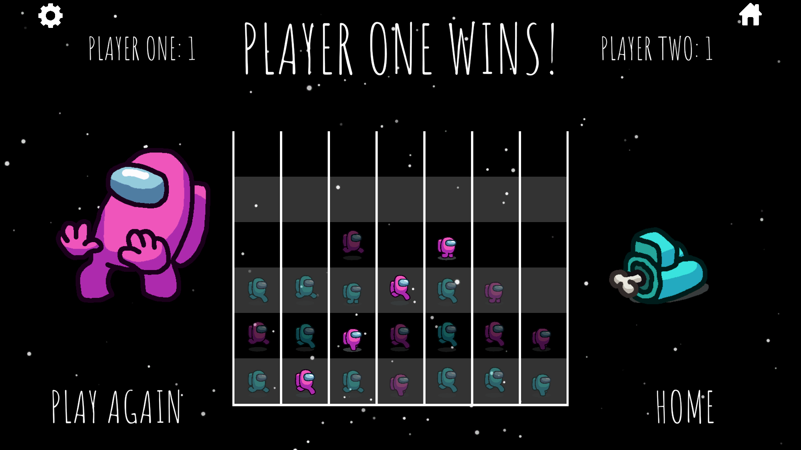
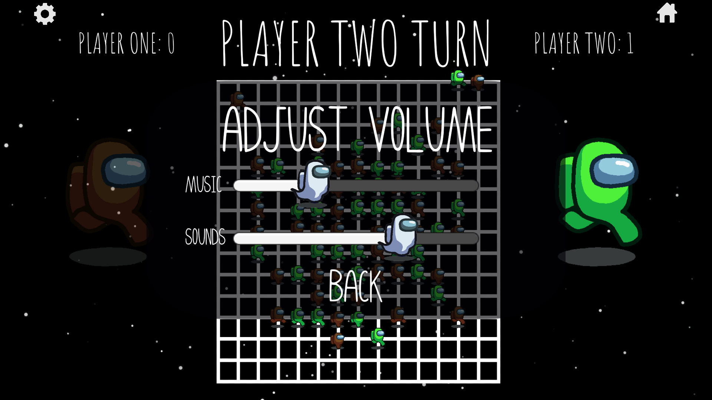
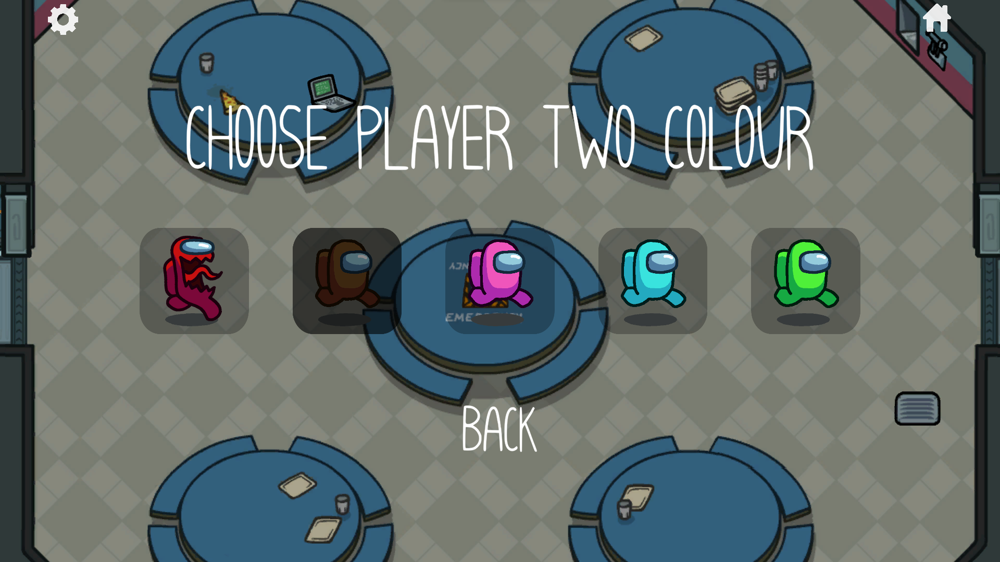
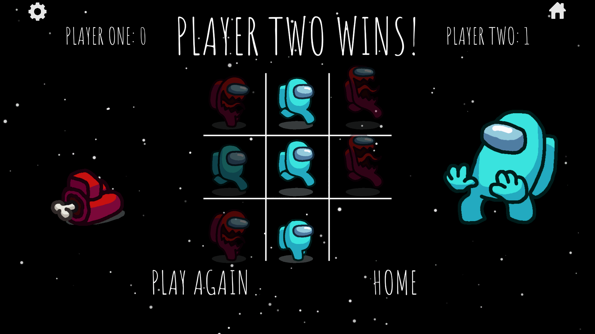
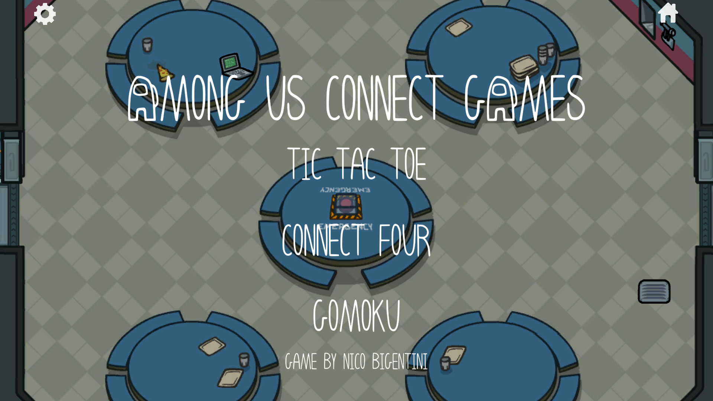

# Tic Tac Toe - Connect 4 - Gomoku
<a href="https://lenibi.github.io/TicTacToe-Connect4-Gomoku/">Click Here To Play</a>
Please allow some loading time! Project may take from 5 seconds to a minute to load.

## Description

My first Unity project on my own after following a lot of tutorials. Simple game to try out UI, sounds, animations, game logic, and general Unity knowledge. Exported to WebGL for easier playability.

## How to play

Choose player 1 and 2 characters, select game mode.
* Tic Tac Toe: Get 3 in a row to win.
* Connect 4: Get 4 in a row to win.
* Gomoku: Get 5 in a row to win.

## Controls

Click with the left mouse button.

